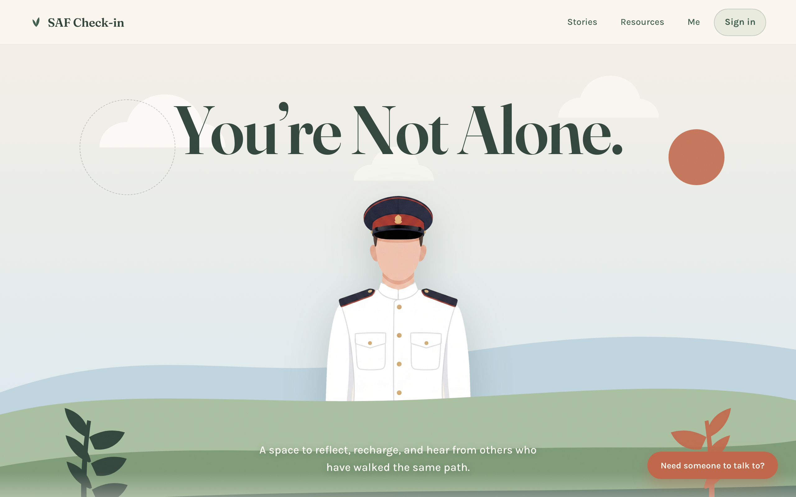
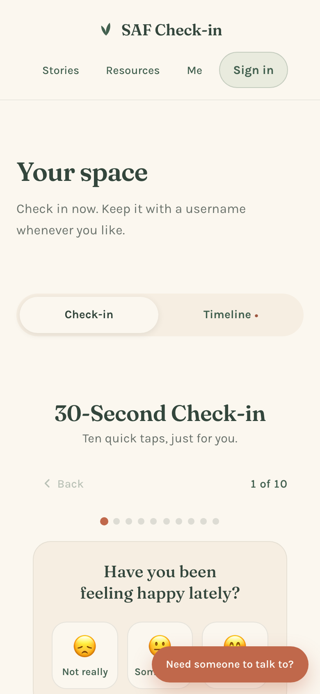
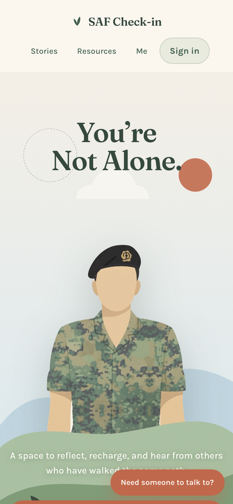
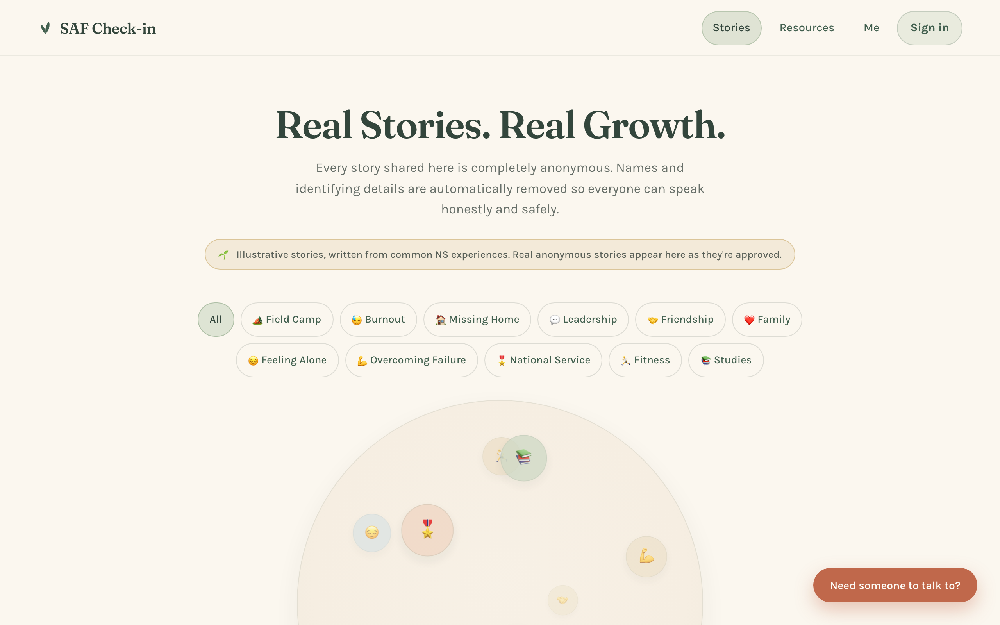

# SAF Check-in — "You're Not Alone."

**An anonymous wellbeing platform for Singapore Armed Forces servicemen.** A 30-second weekly check-in, a private mood timeline, real stories from people who've walked the same path, practical NS-specific resources, and verified helplines — built so that nobody, including the people who run it, can tell who you are.

**Live:** https://saf-checkin.web.app



## Why it exists

National Service is hard, and it's often hardest to say so. Existing help exists (counsellors, paracounsellors, helplines) but the first step — admitting something's off — is the one people skip. SAF Check-in makes that step tiny (ten emoji taps), private (nothing leaves the phone unless you choose), and less lonely (stories from others, anonymised by design).

The faceless officer in the hero isn't a style choice alone — it's the product promise. No faces, no names, no ranks, no units. Ever.

## What's in it

| | |
|---|---|
| **30-second check-in** | Ten questions from the counselling brief, emoji answers, optional follow-up reasons. Works signed-out, on-device, offline. |
| **Mood timeline** | Your check-ins over time, with the pattern behind them. Syncs across phones under a username. |
| **Stories** | Anonymised first-person stories across 11 NS themes (field camp, burnout, missing home, leadership…). An interactive 3D story sphere on desktop. Anyone can share — with or without an account. |
| **Anonymisation pipeline** | Names, ranks, units, locations and dates are stripped *on the phone* before anything is sent; the writer reviews the cleaned version; a moderator approves before it's public. No author identity is ever stored. |
| **Resources** | Five topics × five practical, NS-specific tips (night duties, field-camp recovery, confinement) with sources. |
| **Emergency support** | One always-visible button on every page: SAF Counselling Centre, Samaritans of Singapore, unit paracounsellors — every number verified against an official page and dated. |
| **Accounts without identity** | Username + password. No email, no phone, no real name. You can delete everything yourself, or wipe a shared phone in one tap. |
| **Installable PWA** | Add to home screen; the check-in works with no signal. |
| **QR blossom tree** | A procedurally generated cherry-blossom tree whose canopy is the site's QR code — scroll and it tilts top-down into a scannable code (Three.js, decodes on desktop and mobile). |

Built and feature-flagged but held back for v1: a guided (non-AI, rule-based) companion with crisis handover, shared weekly polls, a moderated recognition wall, growth challenges, and an aggregate anonymous trends view for commanders (minimum group size 10, no drill-down).

<p align="center">
  
  &nbsp;
  
</p>



## Design

Calm, warm, not clinical. Flat editorial wellness illustration with a grain texture; cream paper, pine and sage greens, dusty blue, terracotta accents; Fraunces for display, Karla for body. The hero is a layered GSAP + Lenis parallax; every animation respects `prefers-reduced-motion`. The officer alternates between the No. 1 ceremonial dress and the No. 4 field uniform on each load. Full rules live in [`DESIGN.md`](DESIGN.md).

Accessibility: 44 px tap targets, keyboard-navigable tablists and radio groups, computed contrast for every token pairing, screen-reader labels throughout.

## Privacy & security

- **No identity, by construction.** Firebase Auth needs an email-shaped id, so the username is slugged into a placeholder address that nothing is ever sent to. There is no password reset because there is no email — the site says so plainly.
- **Firestore rules do the enforcing**, not the client: owner-only access to a user's own tree; story submission allowed for any session but validated field-by-field with size caps; public reads only for `published` docs; moderators allow-listed in a collection that clients can never write.
- **No author ids on public content.** A published story cannot be traced to an account, even by the operators.
- **Hardened hosting:** enforced Content-Security-Policy, `X-Frame-Options: DENY`, Permissions-Policy, referrer-restricted API key, CI actions pinned to SHAs with job-scoped permissions.
- **Anti-abuse without a server:** Firebase App Check (reCAPTCHA v3) on every Firestore/Auth call.
- **User control:** `/privacy` in plain language, "Delete my space" (self-service, immediate), "Clear this device" for shared bunk phones.
- Independently audited for the common failure modes of quickly-built sites (open rules, leaked ids, missing CSP, unbounded writes) — findings fixed the same day.

## Tech

**React 19 · TypeScript · Vite · react-router 7 · GSAP + Lenis · Three.js · Firebase (Auth, Firestore, Hosting, App Check) · Playwright**

```
src/
  components/   Hero (parallax), QrTree (three.js), StorySphere, Spinner, CloudFace, moderation/
  pages/        Home, Me (check-in · timeline), Stories, Resources, Account, Privacy, Moderate, NotFound
  lib/          auth (pseudonymous accounts), db (typed Firestore), sync, anonymise, risk, flags, pwa
  data/         check-in questions, stories, resources, verified contacts, poll & challenge banks
firestore.rules        the real security boundary
public/sw.js           hand-written, base-path-aware service worker
verify/                Playwright e2e suite run against production with prefixed test accounts + cleanup
```

Free tier only: Firebase Spark, no Cloud Functions — so the anonymiser is deterministic client-side code behind an `Anonymiser` interface and the companion is rule-based behind a `CompanionProvider` interface, both labelled honestly in the UI. LLM versions can slot in behind the same interfaces once a server and counselling sign-off exist.

## How it was built

Designed from a counselling vision doc, then built over two weeks with an agentic workflow: a foundation commit defining shared contracts (data modules, typed db layer, security rules), parallel feature agents in isolated git worktrees, an integrator, an accessibility pass, and an end-to-end suite run against production — nine feature branches (25 commits) merged with zero conflicts. Every route is screenshot-verified on desktop and mobile; the QR tree is verified by actually decoding the rendered frame.

## Run locally

```bash
npm install
npm run dev        # http://localhost:5173
npm run build      # tsc + vite build
npm run lint       # oxlint
```

Deploys on push to `main` via GitHub Actions → Firebase Hosting (see [`DEPLOYMENT.md`](DEPLOYMENT.md)).

## Credits

Concept and counselling brief: Krish. Build, design system and security: Lucas de la Vega Mazzoni. Not an official MINDEF/SAF service.

If you're in Singapore and struggling right now: **SAF Counselling Centre 1800-278-0022 · Samaritans of Singapore 1767 (24h) · mindline.sg 1771.**
